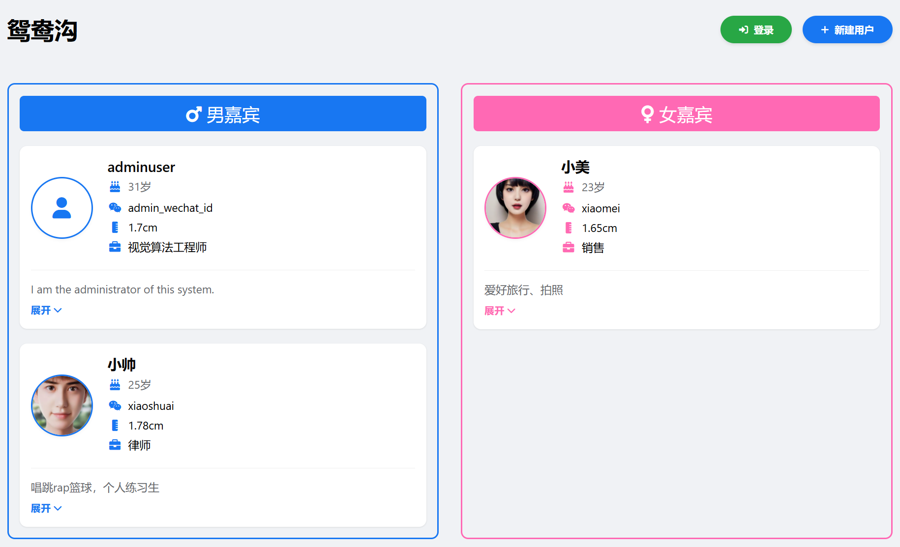
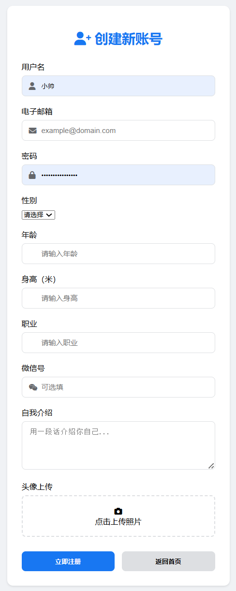
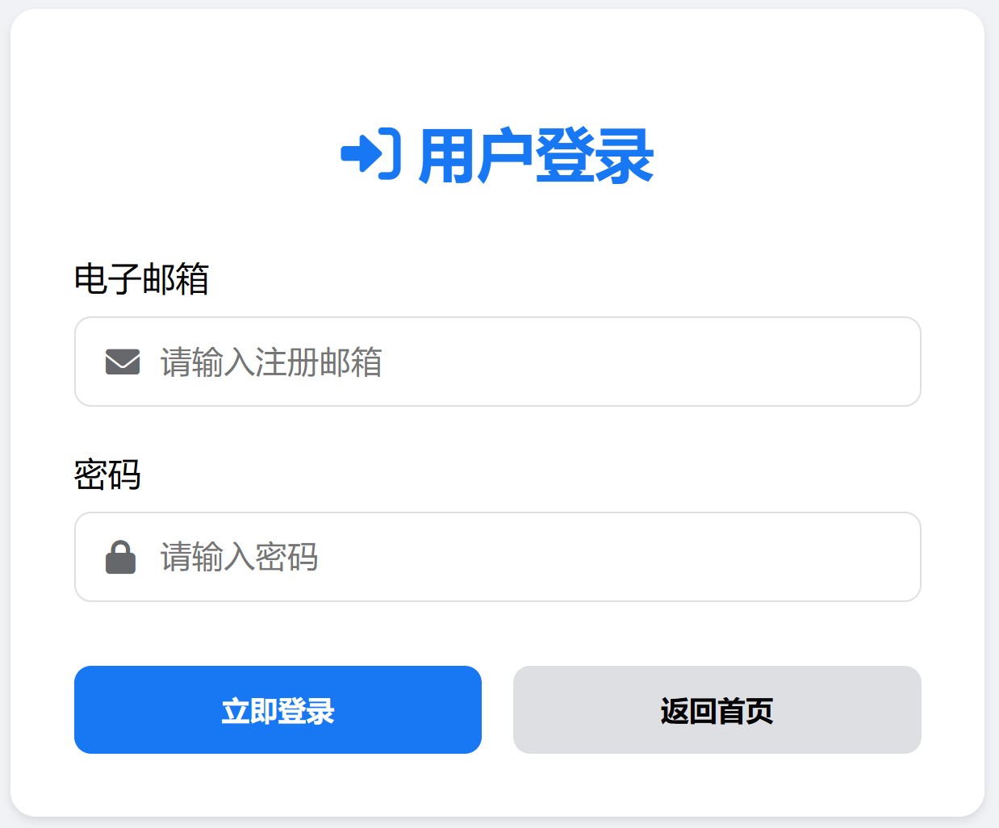

## **一、项目简介**
个人第一个创业项目。
基于FastAPI、PostgreSQL和Docker的用户管理系统的社交app。
面向广大单身青年，旨在帮助用户展示自我并快速找到合适的伴侣。
欢迎大家注册，免费使用！

**主界面：**

**注册界面：**

**登录界面：**

## **二、web地址**
请使用 Web 浏览器访问 https://yuanyango.online 进行体验。

## **三、联系方式**
如需要讨论web app改进以及创业合作相关事宜，请联系

